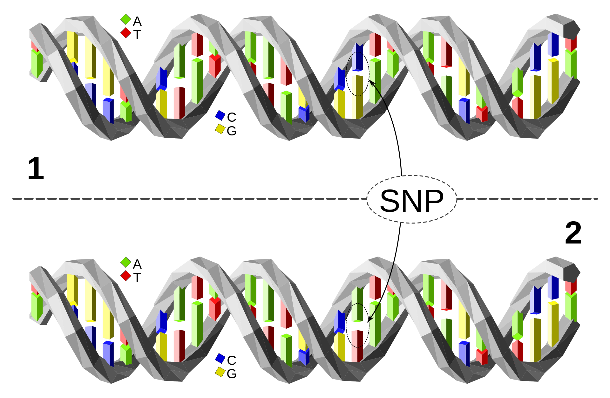
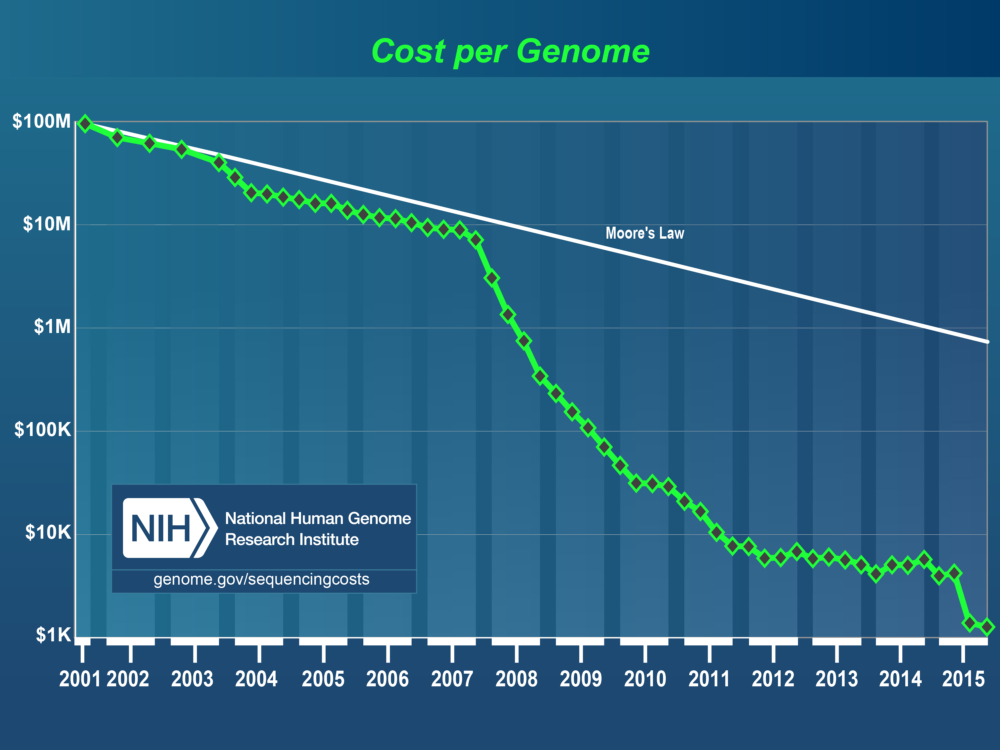
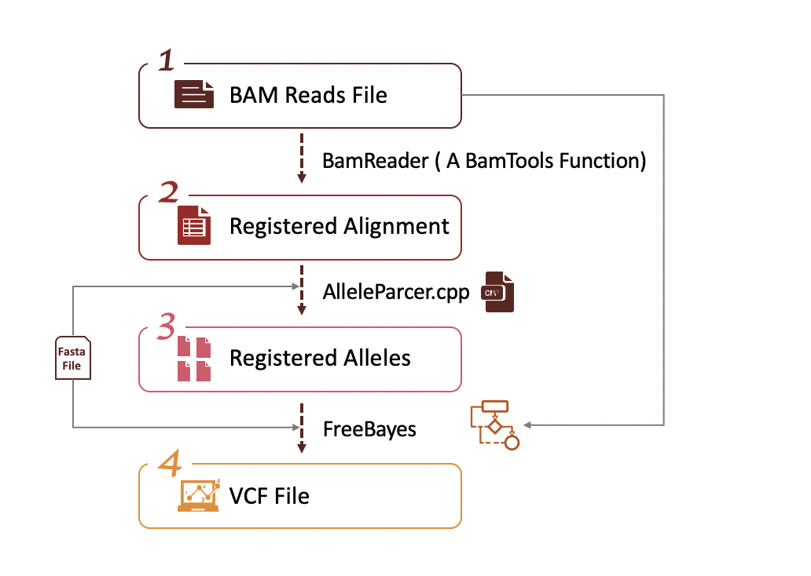
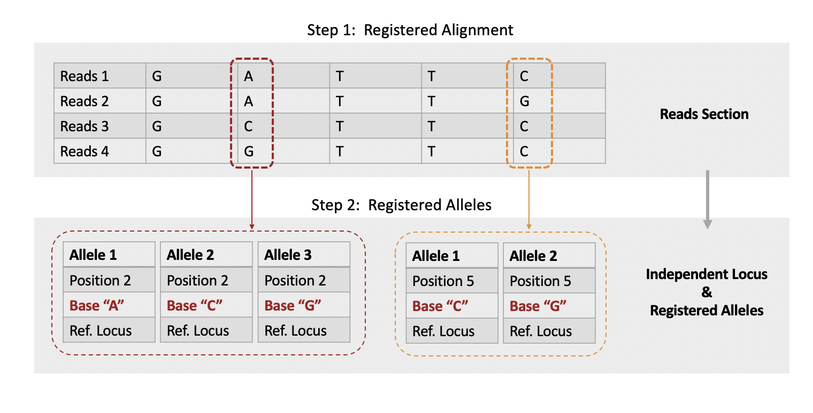
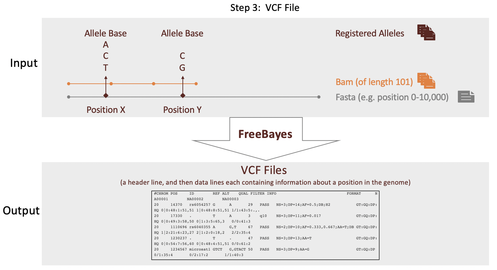
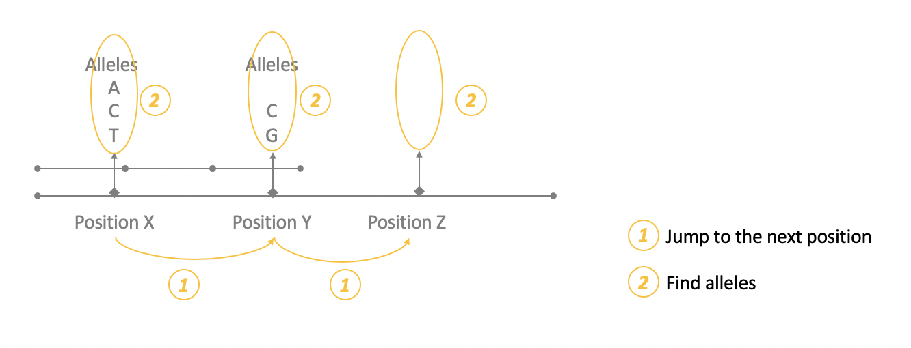
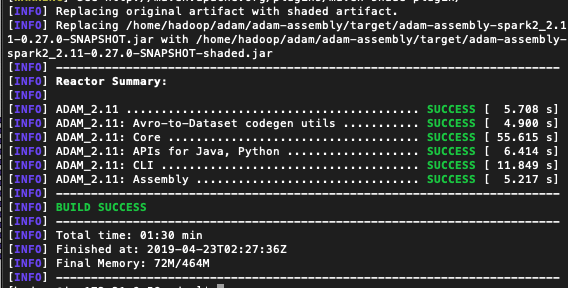
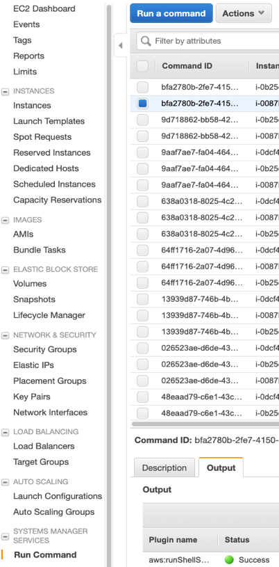
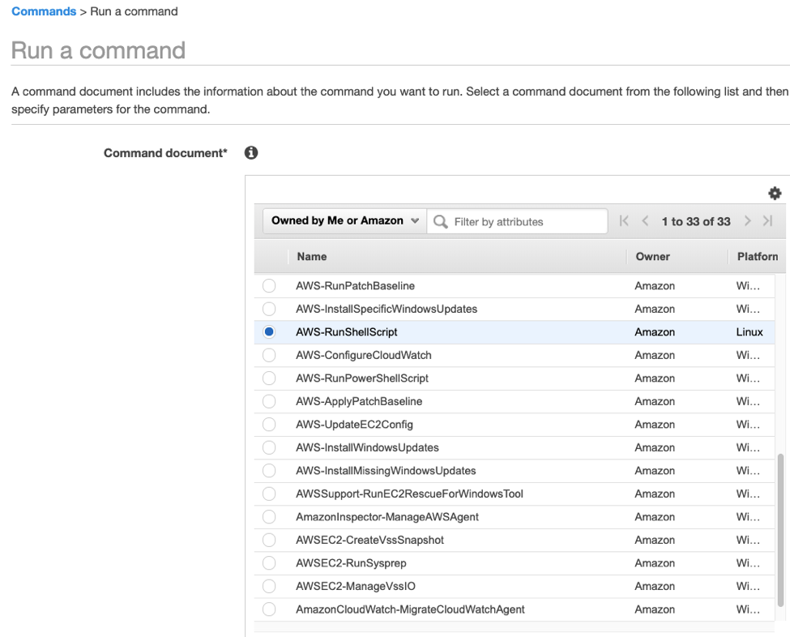
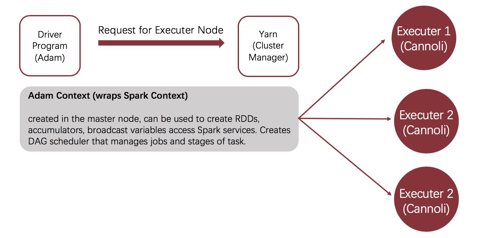

### Harvard University - CS205 Computing Foundations for Computational Science - Spring 2019 - Final Project

# Parallelization on Single-Nucleotide Variant (SNV) Calling

Team Members: Zijie Zhao, Pu Zheng, Weihung Hsu, Kangli Wu

---

**Table of Contents**
<!-- Table of contents generated generated by http://tableofcontent.eu -->
- [Introduction](#introduction)
    - [Motivation: Genomic Sequencing and Variant Calling](#motivation-genomic-sequencing-and-variant-calling)
    - [Need for Both HPC and Big Data Computing](#need-for-both-hpc-and-big-data-computing)
- [Model and Data](#model-and-data)
  - [How the Model Works](#how-the-model-works)
  - [Genome Data](#genome-data)
- [Infrastructure](#infrastructure)
- [Setting Up and Profiling FreeBayes](#setting-up-and-profiling-freebayes)
  - [Setting Up ADAM on Spark with ADAM’s Pipe API Cannoli](#setting-up-adam-on-spark-with-adam's-pipe-api-cannoli)
  - [Setting Up OpenMP Cluster for GNU Parallelization](#setting-up-openmp-for-gnu-parallelization)
  - [Profiling](#profiling)
- [Benchmarking with Existing Work](#benchmarking-with-existing-work)
  - [Existing GNU Parallelization](#existing-gnu-parallelization)
  - [Constructing Benchmark](#constructing-benchmark)
- [Speedup Techniques & Programming Model Details](#speedup-techniques-programming-model-details)
  - [Strategy I: Chopping bam file into chunks](#strategy-I-chopping-bam-file-into-chunks)
  - [Strategy II: Use OpenMP to Parallelize For Loops in Freebayes Main Function](#strategy-II-use-openmp-to-parallelize-for-loops-in-freebayes-main-function)
  - [Strategy III: Stream Data Processing with Spark RDDs](#strategy-III-stream-data-processing-with-spark-rdds)
- [Performance Evaluation and Goals Achieved](#performance-evaluation-and-goals-achieved)
  - [Benchmark](#benchmark)
  - [Strategy I: Chopping bam file into chunks](#strategy-I-chopping-bam-file-into-chunks)
  - [Strategy II: Use OpenMP to Parallelize For Loops in Freebayes Main Function](#strategy-II-use-openmp-to-parallelize-for-loops-in-freebayes-main-function)
  - [Strategy III: Stream Data Processing with Spark RDDs](#strategy-III-stream-data-processing-with-spark-rdds)
  - [Goals Achieved](#goals-achieved)
- [Advanced Feature: GNU Parallel](#advanced-feature-gnu-parallel)
- [Challenges & Lesson Learned & Future Work](#challenges-lesson-learned-future-work)
  - [Load Balancing](#load-balancing)
  - [Spark](#spark)
  - [IO Overhead](#io-overhead)
  - [Lesson Learned and Future Work](#lesson-learned-and-future-work)
- [References](#references)


---
### Introduction

#### Motivation: Genomic Sequencing and Variant Calling

**Genomic Sequencing**

[Genome sequencing](http://www.genomenewsnetwork.org/resources/whats_a_genome/Chp2_1.shtml) is the process of figuring out the order of DNA nucleotides (A, C, G, and T) in a genome. The human genome is made up of over 3 billion of these genetic letters. Such sequences are similar to sentences without spacing or capitalization, they need to be "decoded" to convey the secrets of genome and life. 

**Variant Calling**

[SNV:](https://en.wikipedia.org/wiki/Single-nucleotide_polymorphism) A single-nucleotide variant is an alteration of a single nucleotide that
occurs at a specific position in the genome. 

[SNPs:](https://en.wikipedia.org/wiki/Single-nucleotide_polymorphism) When SNVs happen with appreciable frequencies throughout the population, they are regarded as SNPs.



Identifying SNPs, or in other words, variant calling, is one of the most significant applications of genomic sequencing. 

1. Firstly, variant calling is essential in determining whether a genetic variant is associated with a disease or trait via association studies

2. Also, SNPs are important in genotyping. More than thousands of SNPs across the entire genome can be genotyped in whole-genome SNP association studies.

3. Further, SNPs can enable Haplotype mapping, where sets of alleles or DNA sequences are clustered so that a single SNP can identify many linked SNPs.

[FreeBayes](https://wiki.gacrc.uga.edu/wiki/Freebayes) is a Bayesian genetic variant detector designed to find small polymorphisms, specifically SNPs. Provided some BAM dataset(s) and a reference sequence, FreeBayes will produce a VCF dataset describing SNPs, indels, and complex variants in samples in the input alignments. It is proved to be able to identify more SNPs more quickly than other variant callers.

In all, our project will focus on the first application -- variant calling and disease association analysis with the help of FreeBayes. The current procedure, thought widely adopted, calls for big compute and parallelization to improve it's performance.

---

#### Need for Both HPC and Big Data Computing

Given the huge size of the data and great demand for computing power, we describe our project as both "Big Data" and "Big Compute." Seperately:

**Genomic Data Abundance: Big Data**

Since this decade, genetic testing is becoming more and more available to people. Everyone can get their gene tested with under a hundred dollars. According to [U.S. National Library of Medicine's report](https://ghr.nlm.nih.gov/primer/testing/genetictesting), more than 1,000 genetic tests are currently in use, and more are being developed. Though such commercial tests can not be used directly in medical studies due to privacy issues, it's popularity and accessibility show that the cost of genetic testing is continuously declining. The report also deduces that eventually the cost of the ultimate genetic test - sequencing an individual’s entire genome - will be less than $1,000.

National Human Genome Research Institute made the same claim in their report of [The Cost of Sequencing a Human Genome](https://www.genome.gov/about-genomics/fact-sheets/Sequencing-Human-Genome-cost). As shown in the picture below, sequencing a genome would cost $100 million in 2001. When the human genome project started, it took around 13 years with a funding of $ 2.1 billion. Around 2007-2009, the cost of sequencing a genome went down from $10 million to $100,000 and around 14 days. Now, it costs only between $1,500 to $1,000. 

In all, because of the diminishing cost of genome sequencing, more and more genomic data is becoming available for analysis.



**Compute Infrastructure Limitation: Big Compute** 

The abundant data available imposes computation stress on infrastructure. 

According to [Intel's report](https://www.intel.com/content/dam/www/public/us/en/documents/white-papers/deploying-gatk-best-practices-paper.pdf), it takes 10 days with a single thread to sequence an individual's genome, and as long as 2700 years to work on 100,000 samples sequentially. 

Thus, it's easy to conclude that the primary overhead currently for genomic sequencing is computation. If we could shorten the time needed for such analysis, the improvement in performance can benefit many related fields and applications. For instance, diseases can be diagnosed faster, researchs can be completed easier, cures might be developed sooner to save more lifes.

In all, given the size of the data and computing power required for analysis, we define our project as both "Big Data" and "Big Compute". And again, our project aims to achieve speedup in the variant calling procedure by parallelizing the FreeBayes algorithm.

---

### Model and Data

#### How the Model Works



The chart above explains the flow of our model.

##### Step One 

The inputs are BAM reads files of length 101. Each entry of the files contain information including start/ end position, alignment, quality, etc. We feed the reads files to BamReader, which is a BamTools function. The outputs of the function are Registered Alignment files. A Registered Alignment file turns long data in a reads file into a data frame, whose columns are the various features and rows are reads.

##### Step Two

The second step is extremely essential. In this step, the AlleleParser.cpp program converts Registered Alignment files into sorted Registered Alleles files. As shown in the graph below, we have from step one rows of reads. In reads sections, there can be loci which contain different allels that are very close to each other. The adjacency of such loci makes it unreasonable to directly partition reads into sections and parallelize on them. Thus, we run the Registered Alignment files through AlleleParcer.cpp and generate Registered Alleles files. Registered Alleles files consist of alleles that a independent from each other and their features such as base, position, referent allele (according to the referent Fasta file), etc. Note that each locus can have up to 4 alleles. Such independent alleles can be easily separated from the others and carried into the next step of analysis involving parallelization.



##### Step Three

In this step, our model take as inputs the Fasta file and Bam files, using them to determine the start and end positions and corresponding loci. It then incorporates those with the previously partitioned Registered Alleles files, and converts the Registered Alleles files into the final outputs -- VCF files via the FreeBayes algorithm. 



**The Bayesian Approach(https://arxiv.org/pdf/1207.3907.pdf)**

[FreeBayes](https://wiki.metacentrum.cz/wiki/FreeBayes), a haplotype-based Bayesian genetic variant detector, is one of the most widely used packages in SNV calling. It uses BAM files for any number of individuals from a population and a reference genome (in FASTA format) to determine the most-likely combination of genotypes for the population at each position in the reference. It reports positions which it finds putatively polymorphic in variant call file (VCF) format. 

For example, given a set of genotypes G1, ..., Gn and observations R1, ..., Rn for all individuals at the current genetic locus, we can use Bayes’ theorem to related the probability of a specific combination of genotypes to both **the quality of sequencing observations** and **a priori expectations** about the distribution of alleles:


Under this decomposition, we have the likelihood that our observations match a given genotype combination (our data likelihood), and
P(G1, ..., Gn), which represents the prior likelihood of observing a specific genotype combination. We estimate the data likelihood as the joint probability that the observations for a specific individual support a given genotype. 

**FreeBayes' Role in Our Model**



To simply put it, there are two main steps that FreeBayes repeatedly performs: **Jump to the next position** and **find alleles.** This is easy to understand by the names. On one position, FreeBayes find all the alleles and perform the bayesian approach. Then, it jumps to the next locus and find all the allels. The process keeps going on. These two steps constitute most of the runtime of our model. In order to speed up, we applied parallelization to both the Fasta file and Bam files in this major step. Specific reasons of this scheme and detailed parallelization methods are explained in depth in the [Speedup Techniques](#speedup-techniques-programming-model-details) part.


#### This Project's Genome Data:
All the data we used in this project are public genomes from the [1000 Genomes Project](http://www.internationalgenome.org/).

**Data Downloads:**

**BAM file:**

The Bam format is a binary format for storing sequence data.
```{bash}
sudo wget 
ftp://ftp.1000genomes.ebi.ac.uk/vol1/ftp/phase3/data/NA21141/alignment/NA21141.chrom20.ILLUMINA.bwa.GIH.low_coverage.20130415.bam
```
**BAI file:**

A Bai file is the index for an according bam file, it has a matching name to the bam. It's used by tools to read the bam file.
```{bash}
sudo wget 
ftp://ftp.1000genomes.ebi.ac.uk/vol1/ftp/phase3/data/NA21141/alignment/NA21141.chrom20.ILLUMINA.bwa.GIH.low_coverage.20130415.bai
```
**BAS file:**

Bas files are statistics generated for alignment files which were distribute alongside the alignment files. Each bam file has an associated bas file.
```{bash}
sudo wget 
ftp://ftp.1000genomes.ebi.ac.uk/vol1/ftp/phase3/data/NA21141/alignment/NA21141.chrom20.ILLUMINA.bwa.GIH.low_coverage.20130415.bas
```
**Reference files:**
```{bash}
sudo wget ftp://ftp.1000genomes.ebi.ac.uk/vol1/ftp/technical/reference/human_g1k_v37.fasta.gz
sudo wget ftp://ftp.1000genomes.ebi.ac.uk/vol1/ftp/technical/reference/human_g1k_v37.fasta.fai
```

To unzip downloaded data, use the command:

```bash
sudo gunzip human_g1k_v37.fasta.gz 
awk 'BEGIN {RS=">"} /20 / {print ">"$0}' human_g1k_v37.fasta > chr20.fa
```
---

### Infrastructure

Our team used AWS c4.xlarge instances to execute all the parallelization schemes for both testing and analysis. We chose to use c4 instances because they are optimized for compute-intensive workloads and deliver very cost-effective high performance at a low price per compute ratio. 

```{bash}
|   Model   | Valid number of CPU cores | Default vCPU | Mem (GiB) | Storage  | Dedicated EBS Bandwidth (Mbps) | Network Performance |
|:---------:|---------------------------|--------------|-----------|----------|--------------------------------|---------------------|
| c4.xlarge | 1, 2                      | 4            | 7.5       | EBS-Only | 750                            | High                |
```
Note that each c4.xlarge instance has up to 2 CPU cores, and a default of 4 virtual CPUs in total.

For Spark on EMR:

- Master Node: c4.xlarge instance 
- Core Node: c4.xlarge instance (8 instances)

For OpenMP:

Instance should within a VPC with subnet mask 172.30.8.0/24
Instance should within a subnet inside previous VPC at 172.30.8.0/28
Allow auto assign public IP
Instance should have security group with:

Inbound: 
```{bash}
|       Type      | Protocol | Port Range    | Source    |
|:---------------:|----------|---------------|-----------|
| Custom TCP Rule | TCP      | 10000 - 10100 | 0.0.0.0/0 |
| Custom TCP Rule | TCP      | 10000 - 10100 | ::/0      |
| SSH             | TCP      | 22            | 0.0.0.0/0 |
| SSH             | TCP      | 22            | ::/0      |
| NFS             | TCP      | 2049          | 0.0.0.0/0 |
| NFS             | TCP      | 2049          | ::/0      |
```

Outbound: 
```{bash}
|    Type    | Protocol | Port Range | Destination |
|:----------:|----------|------------|-------------|
| All Trafic | All      | All        | 0.0.0.0/0   |
```
Detailed configurations including the number of worker nodes can be found in later parts.

---

### Setting Up and Profiling FreeBayes

#### Setting Up ADAM on Spark with ADAM’s Pipe API Cannoli

**Adam** 

ADAM is a library and command line tool that enables the use of Apache Spark to parallelize genomic data analysis across cluster/cloud computing environments. ADAM uses a set of schemas to describe genomic sequences, reads, variants/genotypes, and features, and can be used with data in legacy genomic file formats such as SAM/BAM/CRAM, BED/GFF3/GTF, and VCF, as well as data stored in the columnar Apache Parquet format. On a single node, ADAM provides competitive performance to optimized multi-threaded tools, while enabling scale out to clusters with more than a thousand cores. ADAM's APIs can be used from Scala, Java, Python, R, and SQL.

**Cannoli - ADAM Pipe API wrappers for bioinformatics tool**

Cannoli is a wrapper built upon ADAM's core API. It has common used bioinformatics tools

                 bwa : ADAM Pipe API wrapper for BWA.
           freebayes : ADAM Pipe API wrapper for Freebayes.
            minimap2 : ADAM Pipe API wrapper for Minimap2.
     samtoolsMpileup : ADAM Pipe API wrapper for samtools mpileup.
              snpEff : ADAM Pipe API wrapper for SnpEff.
                 vep : ADAM Pipe API wrapper for Ensembl VEP.
         vtNormalize : ADAM Pipe API wrapper for vt normalize.

External commands wrapped by Cannoli should be installed to each executor node in the cluster

**Create EMR cluster**

Create:
  - Master Node: c4.xlarge instance 
  - Core Node: c4.xlarge instange (8 instances)
  - Software Config: Ganglia3.7.2, Spark2.4.0, Zeppelin0.8.1

**Install Adam on AWS EMR**

```Bash
# install git
sudo yum isntall git


# install maven 
sudo wget http://repos.fedorapeople.org/repos/dchen/apache-maven/epel-apache-maven.repo -O /etc/yum.repos.d/epel-apache-maven.repo
sudo sed -i s/\$releasever/6/g /etc/yum.repos.d/epel-apache-maven.repo
sudo yum install -y apache-maven

# install java1.8
sudo yum install java-1.8.0
# or if you need a java compiler and other developer tools:
sudo yum install java-1.8.0-openjdk-devel

# then use the alternatives command to make Java 1.8 the default.
sudo /usr/sbin/alternatives --config java
sudo /usr/sbin/alternatives --config javac

# install Adam
git clone https://github.com/bigdatagenomics/adam.git
cd adam
sed -i 's/2.6.0/2.7.2/' pom.xml
./scripts/move_to_spark_2.sh
export MAVEN_OPTS="-Xmx512m -:MaxPermSize=256m"
mvn clean package -DskipTests

# Set the adam submit path
export PATH=/home/hadoop/adam/bin:$PATH
```

If successfully compiled should see this:



**Test if Adam is working**

Turn bam file into adam file ( would decrease the file size )
```Bash
# put the bam file into the hadoop file system
hadoop fs -put sample.bam

# submit the bam file, the output would be sample.alignments.adam
adam-submit \
  transformAlignments \
  sample.bam \
  sample.alignments.adam
```

**Install Cannoli and third party FreeBayes on all core nodes**

Use [AWS run command](https://docs.aws.amazon.com/systems-manager/latest/userguide/execute-remote-commands.html) and install Cannoli on all instances 

```Bash
# install git
sudo yum install git


# install maven 
sudo wget http://repos.fedorapeople.org/repos/dchen/apache-maven/epel-apache-maven.repo -O /etc/yum.repos.d/epel-apache-maven.repo
sudo sed -i s/\$releasever/6/g /etc/yum.repos.d/epel-apache-maven.repo
sudo yum install -y apache-maven

# install java1.8
sudo yum install java-1.8.0
# or if you need a java compiler and other developer tools:
sudo yum install java-1.8.0-openjdk-devel

# then use the alternatives command to make Java 1.8 the default.
sudo /usr/sbin/alternatives --config java
sudo /usr/sbin/alternatives --config javac

# install cannoli
git clone https://github.com/bigdatagenomics/cannoli.git
cd cannoli
mvn install

# install freebayes
git clone --recursive git://github.com/ekg/freebayes.git
cd freebayes
make
```

**Run FreeBayes from Master Node By command**

```Bash
# with sample.bam and reference in home directory
 ./adam/cannoli/bin/cannoli-submit freebayes \sample.bam \-reference ref.fasta \ > test.vcf
```

**Run FreeBayes by Cannoli Shell**

```Bash
# import libraries
import org.apache.spark.{SparkConf, SparkContext}
import org.bdgenomics.adam.rdd.ADAMContext
import org.bdgenomics.adam.rdd.ADAMContext._
import org.bdgenomics.cannoli.cli._
import org.bdgenomics.cannoli.Cannoli._
import org.bdgenomics.cannoli.cli.Cannoli._

import htsjdk.variant.vcf.VCFHeaderLine
import org.apache.spark.SparkContext
import org.apache.spark.util.CollectionAccumulator
import org.bdgenomics.adam.models.VariantContext
import org.bdgenomics.adam.rdd.read.{ AlignmentRecordDataset, BAMInFormatter }
import org.bdgenomics.adam.rdd.variant.{ VariantContextDataset, VCFOutFormatter }
import org.bdgenomics.adam.sql.{ VariantContext => VariantContextProduct }
import org.bdgenomics.cannoli.builder.CommandBuilders
import org.bdgenomics.utils.misc.Logging
import org.kohsuke.args4j.{ Option => Args4jOption }
import scala.collection.JavaConversions._

# create spark context
val sample = "sample"
val conf = new SparkConf().setAppName("adam")
val sc = new SparkContext(conf)

# wrap spark context with adam 
val ac = new ADAMContext(sc)

# read bam file
val reads = ac.loadAlignments("sample.bam")

# reference file
val reference = "human_g1k_v37.fasta"

# Create Freebayes argument class and point to reference
val freebayesArgs = new FreebayesArgs()
freebayesArgs.referencePath = reference

# Call freebayes and output to sample.freebayes.vcf
val variantContexts = markdup.callVariantsWithFreebayes(freebayesArgs)
variantContexts.saveAsVcf(sample + ".freebayes.vcf")
```

#### Setting Up OpenMP Cluster for GNU Parallelization

**Create instances**

Create c4.xlarge instance with Ubuntu 16.04
Instance should within a VPC with subnet mask 172.30.8.0/24
Instance should within a subnet inside previous VPC at 172.30.8.0/28
Allow auto assign public IP

Instance should have security group with:

Inbound: 
```{bash}
|       Type      | Protocol | Port Range    | Source    |
|:---------------:|----------|---------------|-----------|
| Custom TCP Rule | TCP      | 10000 - 10100 | 0.0.0.0/0 |
| Custom TCP Rule | TCP      | 10000 - 10100 | ::/0      |
| SSH             | TCP      | 22            | 0.0.0.0/0 |
| SSH             | TCP      | 22            | ::/0      |
| NFS             | TCP      | 2049          | 0.0.0.0/0 |
| NFS             | TCP      | 2049          | ::/0      |
```

Outbound: 
```{bash}
|    Type    | Protocol | Port Range | Destination |
|:----------:|----------|------------|-------------|
| All Trafic | All      | All        | 0.0.0.0/0   |
``` 
(install packages and modify hosts can be done in batch)

**Install packages**

```{bash}
sudo apt-get update
sudo apt-get --assume-yes install parallel zlib1g-dev libbz2-dev liblzma-dev bamtools
sudo apt-get --assume-yes install make cmake gcc g++ awscli samtools nfs-common
git clone --recursive git://github.com/ekg/freebayes.git 
cp /home/ubuntu/freebayes/vcflib/tabixpp/tabix.hpp /home/ubuntu/freebayes/vcflib/src/
cd freebayes
make
make install
```
 
**Modify hosts file**

1.  
```{bash}
Sudo vim /etc/hosts
```
Add the following:
```{bash}
172.30.8.8 ip-172-30-8-8 master
172.30.8.10 ip-172-30-8-10 node1
172.30.8.4 ip-172-30-8-6 node2
172.30.8.9 ip-172-30-8-9 node3
172.30.8.12 ip-172-30-8-12 node4
```

2.  Add this command to remove some warnings:
```{bash}
sudo -- sh -c "echo 127.0.1.1 $(hostname) >> /etc/hosts"
```

3.  Notice: now you can ssh to master by:
```{r}
ssh freebayes@master
```

However, you still need to type in password. So we need to remove it.
 
**Modify ssh**
1.  
```{r}
Sudo vim /etc/ssh/sshd_config
```
Go to line:
"# Change to no to disable tunnelled clear text passwords PasswordAuthentication yes"
Make sure this is yes

2.  Update the configuration by:
```{r}
sudo service ssh restart
```
 
**Add new user**
```{r}
Sudo adduser freebayes
Sudo adduser freebayes sudo
```

**Create ssh-key to skip typing in password during ssh to master**
```{bash}
Ssh-keygen (use default values by pressing many enters)
Ssh-copy-id freebayes@master
```
Now you can ssh to master without typing in password!
 
**Map NFS data folder (make sure nfs-common is already installed)**
```{bash}
Su - freebayes
Mkdir data
sudo mount -t nfs master:/home/freebayes/data /home/freebayes/data
```

##### Special setups for master node
1.  SSH connection
Password free SSH connection should be built from master to every worker node, therefore:
```{bash}
ssh-keygen
ssh-copy-id freebayes@node1
ssh-copy-id freebayes@node2
ssh-copy-id freebayes@node3
……
```

2.  NFS server
```{bash}
sudo apt-get install nfs-kernel-server
sudo -- sh -c "echo /home/freebayes/data *(rw,sync,no_root_squash,no_subtree_check)>> /etc/exports"
sudo exportfs -a
sudo service nfs-kernel-server restart
```

3.  Download data
```{bash}
sudo wget 
ftp://ftp.1000genomes.ebi.ac.uk/vol1/ftp/phase3/data/NA21141/alignment/NA21141.chrom20.ILLUMINA.bwa.GIH.low_coverage.20130415.bai
sudo wget 
ftp://ftp.1000genomes.ebi.ac.uk/vol1/ftp/phase3/data/NA21141/alignment/NA21141.chrom20.ILLUMINA.bwa.GIH.low_coverage.20130415.bam
sudo wget 
ftp://ftp.1000genomes.ebi.ac.uk/vol1/ftp/phase3/data/NA21141/alignment/NA21141.chrom20.ILLUMINA.bwa.GIH.low_coverage.20130415.bas
```

4.  Download reference
```{bash}
sudo wget ftp://ftp.1000genomes.ebi.ac.uk/vol1/ftp/technical/reference/human_g1k_v37.fasta.gz
sudo wget ftp://ftp.1000genomes.ebi.ac.uk/vol1/ftp/technical/reference/human_g1k_v37.fasta.fai
sudo gunzip human_g1k_v37.fasta.gz 
awk 'BEGIN {RS=">"} /20 / {print ">"$0}' human_g1k_v37.fasta > chr20.fa
```

5.  Create a hostfile so you can call sub-nodes in GNU parallel:

a.  Write the following info into a file called hostfile:
```{bash}
# four cores in local node
@mastergroup/4/:
# four cores in worker node
@workergroup+g1+g2+g4/4/freebayes@node1
@workergroup+g2+g4/4/freebayes@node2
@workergroup+g4/4/freebayes@node3
@workergroup+g4/4/freebayes@node4
……
```

b.  Check corresponding host names in this hostfile:
```{bash}
parallel --nonall --slf hostfile hostname
```

You should see output like this when its fully setup:
ip-172-30-8-8
ip-172-30-8-10
ip-172-30-8-9
ip-172-30-8-4
ip-172-30-8-12


**Batch Install packages**
1.  Go to run command



2.  Select command document to be "AWS-RunShellScript"



3.  Put commands into command box

```{bash}
# install required packages
sudo apt-get update
sudo apt-get --assume-yes install parallel zlib1g-dev libbz2-dev liblzma-dev bamtools
sudo apt-get --assume-yes install make cmake gcc g++ awscli samtools nfs-common
git clone --recursive git://github.com/ekg/freebayes.git 
cp /home/ubuntu/freebayes/vcflib/tabixpp/tabix.hpp /home/ubuntu/freebayes/vcflib/src/
cd freebayes
make
make install
# modify /etc/hosts 
sudo -- sh -c "echo 127.0.1.1 $(hostname) >> /etc/hosts"
sudo -- sh -c "echo 172.30.8.8 ip-172-30-8-8 master >> /etc/hosts"
sudo -- sh -c "echo 172.30.8.10 ip-172-30-8-10 node1>> /etc/hosts"
sudo -- sh -c "echo 172.30.8.4 ip-172-30-8-4 node2 >> /etc/hosts"
sudo -- sh -c "echo 172.30.8.9 ip-172-30-8-9 node3 >> /etc/hosts"
sudo -- sh -c "echo 172.30.8.12 ip-172-30-8-12 node4 >> /etc/hosts"
```
 
4.  Run, if there is a green light with success, the commands are correctly processed. 

#### Profiling

Profling was completed using the [GNU gprof](https://sourceware.org/binutils/docs/gprof/) profiler. 

##### Compile new version to allow profiling freebayes
Notice: you may need to move tabix.hpp from freebayes/vcflib/tabixpp to freebaayes/vcflib/src to properly compile.
To run gprof on freebayes:

Compile gprof in a copy of free-bayes
```Bash
$ cd ./freebayes-openmp 
$ cd ./src
$ make gprof
```

Run freebayes for one sample
```Bash
$ time /home/ubuntu/freebayes-openmp/bin/freebayes -f /home/freebayes/data/chr20.fa -v /home/ubuntu/NA21141_chr20_serial_2.vcf /home/freebayes/data/NA21141.chrom20.ILLUMINA.bwa.GIH.low_coverage.20130415.bam
real  63m1.755s
user  62m59.056s
sys 0m2.652s
```

Run freebayes for a 1Mb region
``` bash
$ time /home/ubuntu/freebayes-openmp/bin/freebayes -f /home/freebayes/data/chr20.fa -v ~/NA21141_chr20_serial_1-2m.vcf -r 20:1000000-2000000 /home/freebayes/data/NA21141.chrom20.ILLUMINA.bwa.GIH.low_coverage.20130415.bam
real  1m18.734s
user  1m18.588s
sys 0m0.148s
```

Run freebayes for multiple sample
```Bash
$ cd /home/freebayes/data
$ ls *.bam > bamlist.txt
$ cat bamlist.txt
NA21130.chrom20.ILLUMINA.bwa.GIH.low_coverage.20130415.bam
NA21133.chrom20.ILLUMINA.bwa.GIH.low_coverage.20130415.bam
NA21135.chrom20.ILLUMINA.bwa.GIH.low_coverage.20130415.bam
NA21137.chrom20.ILLUMINA.bwa.GIH.low_coverage.20120522.bam
NA21141.chrom20.ILLUMINA.bwa.GIH.low_coverage.20130415.bam
NA21142.chrom20.ILLUMINA.bwa.GIH.low_coverage.20130415.bam
NA21143.chrom20.ILLUMINA.bwa.GIH.low_coverage.20130415.bam
NA21144.chrom20.ILLUMINA.bwa.GIH.low_coverage.20130415.bam
$ time /home/ubuntu/freebayes-openmp/bin/freebayes -f ~/data/chr20.fa -r 20:1000000-1200000 -v 8samples.vcf -L bamlist.txt
real  10m31.043s
user  10m30.812s
sys 0m0.220s
```

In the folder you ran the the code you will find a file - "gmon.out". Then do to profileing:
```Bash
$ gprof -l /home/ubuntu/freebayes-openmp/bin/freebayes ./gmon.out > profile.stats
```

View the profiling results with vim
```Bash
$ vim profile.stats
```

##### Profiling results

1. profiling of freebayes on whole chromosome dataset:
1.1 Flat profile: 
The flat profile shows the total amount of time your program spent executing each function.

```Bash
Flat profile:

Each sample counts as 0.01 seconds.
  %   cumulative   self              self     total           
 time   seconds   seconds    calls   s/call   s/call  name    
  1.79     10.53    10.53 63261090     0.00     0.00  AlleleParser::getAlleles(Samples&, int, int, bool, bool)
  1.74     20.78    10.25 832337941     0.00     0.00  std::vector<Allele*, std::allocator<Allele*> >::begin()
  1.72     30.94    10.16 4027137555     0.00     0.00  __gnu_c
::__normal_iterator<Allele**, std::vector<Allele*, std::al
  1.48     39.68     8.74 8433447588     0.00     0.00  __gnu_c
::__normal_iterator<Allele**, std::vector<Allele*, std::al
  1.39     47.90     8.22 472961892     0.00     0.00  Allele::setQuality()
  1.38     56.02     8.12  4892795     0.00     0.00  AlleleParser::registerAlignment(SeqLib::BamRecord&, RegisteredAlignme
  1.34     63.91     7.89 9843533063     0.00     0.00  __gnu_c
::__normal_iterator<Allele**, std::vector<Allele*, std::al
  1.34     71.79     7.88 262273417     0.00     0.00  std::vector<Allele*, std::allocator<Allele*> >::_M_insert_aux(__gnu_
  1.23     79.07     7.28 62905522     0.00     0.00  AlleleParser::toNextPosition()
  1.20     86.16     7.09 3037332944     0.00     0.00  std::vector<Allele*, std::allocator<Allele*> >::end()
  1.14     92.88     6.72 3161144807     0.00     0.00  bool __gnu_c
::operator!=<Allele**, std::vector<Allele*, std::allo
  0.87     98.01     5.14 1956473331     0.00     0.00  std::_Rb_tree<Allele*, Allele*, std::_Identity<Allele*>, std::less<
  0.83    102.92     4.91 4043041148     0.00     0.00  __gnu_c
::__normal_iterator<Allele**, std::vector<Allele*, std::al
  0.71    107.09     4.18 491277659     0.00     0.00  phred2ln(int)
  0.69    111.18     4.09 262273421     0.00     0.00  std::vector<Allele*, std::allocator<Allele*> >::_M_check_len(unsigne

```
From the flat profile, we can see that the functions that spent the most time are AlleleParser::getAlleles() Allele::setQuality() AlleleParser::registerAlignment() and AlleleParser::toNextPosition(). However, they only spend about 1.79% 1.39%, 1.38% and 1.23% of the total execution time. By looking at flag profile it is hard to determine the key step that spent most of computation time. This is probably caused by multi-level wrapping of this package. Therefore we decided to study deeply into call graph.

  1.2 The Call Graph: 

The call graph shows how much time was spent in each function and its children. From this information, you can find functions that, while they themselves may not have used much time, called other functions that did use unusual amounts of time.

In the first level:
```Bash
granularity: each sample hit covers 2 byte(s) for 0.00% of 589.63 seconds

index % time    self  children    called     name
                                                 <spontaneous>
[1]     89.3    3.88  522.63                 main [1]
                1.81  435.31 62725333/62725333     AlleleParser::getNextAlleles(Samples&, int) [2]
                0.23   29.52  124292/124292      AlleleParser::buildHaplotypeAlleles(std::vector<Allele, std::allocator<All
                1.73    5.44 62725331/62725331     sufficientAlternateObservations(Samples&, int, float) [79]
                0.21    6.00  103378/103378      Results::vcf(vcflib::Variant&, ttmath::Big<4ul, 1ul>, long double, Samples
                0.00    6.09  103378/103378      logsumexp_probs(std::vector<long double, std::allocator<long double> > con
```
89.3% of the time is in the main function, and most of time is spent in "AlleleParser::getNextAlleles". Therefore we going deep into this function:

Moving down to the second level:
```Bash
                1.81  435.31 62725333/62725333     main [1]
[2]     74.1    1.81  435.31 62725333         AlleleParser::getNextAlleles(Samples&, int) [2]
               10.47  219.47 62905521/63261090     AlleleParser::getAlleles(Samples&, int, int, bool, bool) [3]
                7.28  198.09 62905522/62905522     AlleleParser::toNextPosition() [4]
```
From this, we can see that in the main function it called AlleleParser::getNextAlleles(Samples&, int) that spent 74.1% of total execution time. In this function, it calles two functions - AlleleParser::toNextPosition() and AlleleParser::getAlleles(Samples&, int, int, bool, bool). 

In the next layer, if we look into the profiling of "AlleleParser::getAlleles", push_back alleles and update function are both in a for loop that can be parallelized. However, these steps only accounts for about 12% of total time. 

```Bash
                0.01    0.31   87664/63261090     AlleleParser::removeDuplicateAlleles(Samples&, std::map<std::__c
                11::bas
                0.04    0.93  267905/63261090     AlleleParser::buildHaplotypeAlleles(std::vector<Allele, std::allocator<Al
               10.47  219.47 62905521/63261090     AlleleParser::getNextAlleles(Samples&, int) [2]
[3]     39.2   10.53  220.71 63261090         AlleleParser::getAlleles(Samples&, int, int, bool, bool) [3]
                3.79   49.56 474504483/475585881     std::map<std::__c
              11::basic_string<char, std::char_traits<char>, std:
                4.05   48.86 474504483/474607861     std::map<std::__c
              11::basic_string<char, std::char_traits<char>, std:
                1.61   48.03 474504483/490414308     std::vector<Allele*, std::allocator<Allele*> >::push_back(Allele* cons
                3.02   25.26 474504483/476859404     Allele::update(int) [12]
```
As for the profling of AlleleParser::toNextPosition(), none of its loops are using significant amount of time. Most time cose is IO related which is hard to parallelize. 

```Bash
                7.28  198.09 62905522/62905522     AlleleParser::getNextAlleles(Samples&, int) [2]
[4]     34.8    7.28  198.09 62905522         AlleleParser::toNextPosition() [4]
                1.03   56.74 62905521/62919660     AlleleParser::updateAlignmentQueue(long, std::vector<Allele*, std::alloc
                0.16   22.72 62905521/63043952     void std::sort<__gnu_c
              ::__normal_iterator<Allele**, std::vector<Allele
                1.83   19.62 652076303/652076303     std::set<Allele*, std::less<Allele*>, std::allocator<Allele*> >::count
                2.22   17.01 62905521/62905521     AlleleParser::removePreviousAlleles(std::vector<Allele*, std::allocator<
                0.27    7.72 62905521/63043952     __gnu_c
              ::__normal_iterator<Allele**, std::vector<Allele*, std::allocat
                0.13    6.30 12736035/12736035     std::map<unsigned long, std::deque<RegisteredAlignment, std::allocator<R
```
2. Profling of multi-sample dataset

Freebayes with multi-sample dataset performs differently. In main function in file "freebayes.cpp", there are two layer of for loops iterate through samples:
```cpp
    while (parser->getNextAlleles(samples, allowedAlleleTypes)) {
      ......
      for (Samples::iterator s = samples.begin(); s != samples.end(); ++s) {
        ......
        do {
          double probRemove = (sampleCoverage - parameters.maxCoverage) / (double)sampleCoverage;
          vector<string> genotypesToErase;
          // iterate through the genotypes
          for (Sample::iterator sg = sample.begin(); sg != sample.end(); ++sg) {
            .......
            for (int alleleIndex = 0; alleleIndex < sg->second.size(); alleleIndex++) {
              .......
            }
          }
        } while (parameters.maxCoverage < sampleCoverage);
      }
    }
```
Therefore we examined the difference between profiling result from multisample comparing with single sample profiling.
We discovered that freebayes with multi-sample dataset spent more time in calling haplotypes:
```bash
                0.03   11.01    9016/9016        main [1]
[5]     12.6    0.03   11.01    9016         AlleleParser::buildHaplotypeAlleles(std::vector<Allele, std::allocator<Allele>
                0.03    6.59    9016/9016        AlleleParser::getCompleteObservationsOfHaplotype(Samples&, int, std::vecto
                0.00    1.55    9016/9646        FastaReference::getSubSequence(std::__c
                11::basic_string<char, std::char_
                0.02    0.49   18780/1027604     AlleleParser::getAlleles(Samples&, int, int, bool, bool) [4]
                0.02    0.43  887159/1681406     std::map<unsigned long, std::deque<RegisteredAlignment, std::allocator<Reg
                0.00    0.36    9016/9016        AlleleParser::removeDuplicateAlleles(Samples&, std::map<std::__c
                11::basi
```
However, this step is not included in loops shown in previous example code. Therefore we expect that if we parallelize those loops, there won't be too much difference in either single-sample and multi-sample cases. 

##### Profile Summary: 
From the profiling result, we can see that most of the time is spent in AlleleParser::getNextAlleles(Samples&, int). getNextAlleles has two functions that spent the most time - AlleleParser::toNextPosition() and AlleleParser::getAlleles(Samples&, int, int, bool, bool). It first calls toNextPosition, in this function, it updates the currentPosition of the bam read. Then getNextAlleles calls the getAlleles function, in this function, it gets the variant allele at the currentPosition and the reference alleles overlapping the currentPosition. So combining the two, getNextAlleles is the function that iterates through the bam read and gets all the allele. The function runs as a single-threaded process. 

---

### Benchmarking with Existing Work

#### Existing GNU Parallelization

["GNU parallel"](https://www.gnu.org/software/parallel/) is a shell tool for executing jobs in parallel using one or more computers. A job can be a single command or a small script that has to be run for each of the lines in the input. In Freebayes package, they have an embarrassingly parallel implementation. It solves many similar, but independent tasks simultaneously, and it need only little or no need for coordination between the tasks. 

The basic idea is to generate fasta region into format: ```chrom_name + ":" + str(region_start) + "-" + str(end)```. Then run Freebayes in parallel on 1000000bp chunks of the ref with multiple threads. Generate regions that are equal in terms of data content, and thus have lower variance.

Usage is shown below:  
```bash
   freebayes-parallel <(fasta_generate_regions.py ref.fa.fai 1000000) 36 -f ref.fa aln.bam >out.vcf
```

The detail of implementing GNU parallel is:
```bash
# iterate over regions using gnu parallel to dispatch jobs
cat "$regionsfile" | parallel -k -j "$ncpus" "${command[@]}" --region {}
) | ../vcflib/scripts/vcffirstheader \
    | ../vcflib/bin/vcfstreamsort -w 1000 | vcfuniq # remove duplicates at region edges
```

#### Constructing Benchmark     

For evaluating our parallelization performance, we construct benchmarks using the existing GNU parallelization with different number of nodes and different number of cores in each node locally. Here we use ```c4.xlarge``` instance with ```Ubuntu 16.04``` type on AWS. We set the chunks size to be 1000000bp. 

The basic command is:
```bash  
time ./freebayes-parallel /home/freebayes/chr20_splice_1000000.fai 1 -f /home/freebayes/data/chr20.fa -v /home/freebayes/data/results/NA21141_chr20_old_c1.vcf /home/freebayes/data/NA21141.chrom20.ILLUMINA.bwa.GIH.low_coverage.20130415.bam
```
Results are shown as below:  

| Case | Methods | Total cores | Numbers of nodes | Cores per node | Times (s) | Speedup
| --- |---|---|---|---|---|---|
| 1 | Freebayes with no parallelization | 1 | 1 | 1 | 861.492 | 1.000
| 2 | Existing GNU parallelization | 1 | 1 | 1 | 1063.37 | 0.810
| 3 | Existing GNU parallelization | 2 | 1 | 2 | 525.82 | 1.638
| 4 | Existing GNU parallelization | 4 | 1 | 4 | 453.91 | 1.898

Those elapsed time will serve as benchmark and be used to evaluate our parallel implementation. 

---

### Speedup Techniques & Programming Model Details

#### Strategy I: Chopping bam file into chunks 

Based on the previous sections, we argue why we could chop .bam file to achieve speedup. Here we illustrate details on how we chop the .bam files. (Please refer to ./src for details.) We firstly calculate the read length M for .bam file. M = 101 in our case. Then for each chromosome, we define the chunk size. We use default value N = 1000000 in our study. Next we chop those .bam files with into identical length .bam file. And we add a cap and tail on each chunks with sizes equal to M. So the chopped .bam files length equal to N+2M.

Then we use GNU parallel for execution with pre-defined fasta regions and our .bam files. Rather than directly save the .bam files, we propose a new way: Freebayes could use .bam files from stdin with argument ```-c```. We could take advantage of it, which could reduce the I/O overheads to some extends.


#### Strategy II：Use OpenMP to parallelize for loops in Freebayes main function

The second strategy is to use OpenMP for share-memory parallelization. We could modify the source code in ```freebayes/src/freebayes.cpp``` by adding ```#pragma omp kernels``` directives to parallel the independent loop iterations. 

Based on the profiling, we add ```#pragma omp kernels``` at line 3576 before the major for loop in ```AlleleParser::getAlleles()```. Then we add ```-fopenmp``` in ```freebayes/src/Makefile``` line 143, at the compilation of ```AlleleParser.cpp```.

#### Strategy III: Stream data processing with Spark RDDs

ADAM is developed to solve 3 problems:
1. scaling the workflow comes down to scaling each of the individual tools,
2. the stability of the workflow heavily depends on the consistency of intermediate file formats, and
3. writing to and reading from disk is a major slow-down.

##### Cannoli - ADAM 
Cannoli is a wrapper built upon ADAM's core API. It covers common used bioinformatics tools.

                 bwa : ADAM Pipe API wrapper for BWA.
           freebayes : ADAM Pipe API wrapper for Freebayes.
            minimap2 : ADAM Pipe API wrapper for Minimap2.
     samtoolsMpileup : ADAM Pipe API wrapper for samtools mpileup.
              snpEff : ADAM Pipe API wrapper for SnpEff.
                 vep : ADAM Pipe API wrapper for Ensembl VEP.
         vtNormalize : ADAM Pipe API wrapper for vt normalize.

External commands wrapped by Cannoli should be installed to each executor node in the cluster.

##### Architecture



Spark architecture: ADAM is built on Spark engine. Spark uses master/slave architecture with one central coordinator and many distributed workers. Each worker is a separate java process. In our EMR, Spark works with open source cluster manager Hadoop Yarn. The master, also known as the driver, is the process that runs the user code that creates RDDs, and performs transformation and action. The driver program asks Yarn for the resources to launch executors. Yarn as the Apache Spark Cluster Manager launches executors. On the cluster manager, jobs and actions within a spark application scheduled by Spark Scheduler in a FIFO fashion. The scheduler in Spark is a Directed Acycli Graph (DAG) scheduler. It provides a drastic speedup since compared to Hadoop MapReduce since it processes in memory. In Hadoop MapReduce, every result is written back to disk. Hence between two map-reduce jobs there might be irrelevant write backs.

ADAM Context: ADAM uses Apache Spark as a computational engine. Only instead of SparkContext, it has its own ADAMContext which wraps SparkContext. Users use the ADAMContext to load data as GenomicDatasets, which they can then manipulate. ADAM exposes access to distributed datasets of genomic data through the ADAMContext entrypoint. The ADAMContext provides data loading functions which yield GenomicDatasets. The GenomicDataset classes provide a wrapper around Apache Spark’s two APIs for manipulating distributed datasets: the legacy Resilient Distributed Dataset and the new Spark SQL Dataset/DataFrame API. Additionally, the GenomicDataset is enriched with genomics-specific metadata such as computational lineage and sample metadata, and optimized genomics-specific query patterns such as region joins and the auto-parallelizing pipe API for running legacy tools using Apache Spark. All GenomicDatasets include a sequence dictionary which describes the reference genome that the data in the genomic dataset are aligned to.

Cannoli: In order to perform freebayes on our BAM file, on each worker node, we install the cannoli library, which is a wrapper built on the ADAM API. It provides easy usage for bioinformatic tools. On each worker node, we download the human genome reference and in our case the freebayes executable. Then on each worker node, it will perform freebayes on the ADAMContext. In theory, ADAM scale linearly as the amount of compute resources is increased. 

---

### Performance Evaluation and Goals Achieved

#### Benchmark

We found that existing GNU parallelization with a single core (case 2) is slower than the original one with no parallelization (case 1). This is obvious since there are some overheads associate with GNU parallelization, e.x. (1) initialization of freebayes. (2) The output of freebayes parallel is saved at a temp and then merged to output. When we increase the total number of cores, we expected to achieve a linear speedup. The empirical speedup is non-linear due to overheads. Those elapsed time will serve as benchmark and be used to evaluate our parallel implementation. 

#### Strategy I: Chopping .bam file into chunks 

Here we use ```c4.xlarge``` instance with ```Ubuntu 16.04``` type to set up cluster on AWS. In this case, we have built a cluster with one master node and seven worker nodes. (Please refer to ./documentation for details.) 

Results based on our GNU parallel implementation are shown as below:

| Case | Total cores | Mode | Numbers of nodes | Cores per node | Times (s) | Speedup to non-parallel | Speed up to GNU parallel
|---|---|---|---|---|---|---|---|
| 1 | 1 | local | 1 | 1 | 1108.274 | 0.777 |---|
| 2 | 2 | local | 1 | 2 | 565.903 | 1.525 |---|
| 3 | 4 | local | 1 | 4 | 475.042 | 1.814 |---|
| 4 | 1 | remote | 1 | 1 | 1133.127 | 0.760 | 1.000|
| 5 | 2 | remote | 1 | 2 | 586.158 | 1.470 | 1.933 |
| 6 | 2 | remote | 2 | 1 | 575.683 | 1.496 | 1.968 |
| 7 | 4 | remote | 1 | 4 | 487.619 | 1.767 | 2.324 |
| 8 | 4 | remote | 2 | 2 | 296.649 | 2.904 | 3.820 |
| 9 | 4 | remote | 4 | 1 | 292.167 | 2.949 | 3.878 |
| 10 | 8 | remote | 4 | 2 | 149.776 | 5.752 | 7.565 |
| 11 | 16| remote | 4 | 4 | 128.79 | 6.689 | 8.798 |
| 12 | 16 | remote | 8 | 2 | 77.145 | 11.167 | 14.688 |
| 13 | 32| remote | 8 | 4 | 65.933 | 13.066 | 17.186 |

1. Compare with the benchmark we construct, it seems the elapsed time with our GNU parallel implementation is slightly longer. This is because this elapsed time incorporate the chopping time of .bam file. In addition, for the existing parallelization, it could not be run remotely. If could, uploading .bam files into multiple nodes would also take much more time. Therefore, our implementation still achieve a decent speedup for large scale variant calling analysis.
2. Remote mode is slower than local mode due to the communication overheads between master and worker nodes, e.x, transferring the .bam files.
3. Our GNU parallelization case (5) (1 node, 2 cores) is slower than than case (6) (2 node, 1 core). Case 6 is faster because their communication doesn’t share bandwidth, it is not limited by local communication speed. 


#### Strategy II：Use OpenMP to parallel for loops in Freebays main function

Results are shown as below:

| Case | Methods | Total cores | Mode | Numbers of nodes | Cores per node | Times (s) | Speedup
| --- |---|---|---|---|---|---| --- |
| 1 | Freebayes with no parallelization | 1 | local | 1 | 1 | 861.492 | 1.000
| 2 | Freebayes with OpenMP | 1 | local | 1 | 1 | 966.898 | 1.222
| 3 | GNU parallelization with OpenMP | 8 | remote | 4 | 2 | 161.631 | 1.079
| 4 | GNU parallelization with OpenMP | 16 | remote | 8 | 2 | 81.102 | 1.051


Based on our results, we found that we don't achieve a significant speedup by adding OpenMP directives. We found OpenMP doesn't help in our case. So we did not further attempt to parallelize Freebayes with OpenMP.

#### Strategy III: Stream data processing with Spark RDDs

Took us a sometime to figure out how and where to set up Adam and Cannoli. Adam only has to be installed on the master node. However cannoli, the human reference genome and the freebayes executable has to be installed on all nodes.  We ssh to slave node from master node and installed the libraries and dependencies. The error shows up if we don't install freebayes on the executor nodes.

```Bash
Caused by: java.io.IOException: Cannot run program "freebayes": error=2, No such file or directory
at java.lang.ProcessBuilder.start(ProcessBuilder.java:1048)
at org.bdgenomics.adam.rdd.GenomicDataset$$anonfun$15.apply(GenomicDataset.scala:866)
at org.bdgenomics.adam.rdd.GenomicDataset$$anonfun$15.apply(GenomicDataset.scala:837)
at org.apache.spark.rdd.RDD$$anonfun$mapPartitions$1$$anonfun$apply$23.apply(RDD.scala:801)
at org.apache.spark.rdd.RDD$$anonfun$mapPartitions$1$$anonfun$apply$23.apply(RDD.scala:801)
at org.apache.spark.rdd.MapPartitionsRDD.compute(MapPartitionsRDD.scala:52)
at org.apache.spark.rdd.RDD.computeOrReadCheckpoint(RDD.scala:324)
at org.apache.spark.rdd.RDD.iterator(RDD.scala:288)
at org.apache.spark.rdd.MapPartitionsRDD.compute(MapPartitionsRDD.scala:52)
at org.apache.spark.rdd.RDD.computeOrReadCheckpoint(RDD.scala:324)
at org.apache.spark.rdd.RDD.iterator(RDD.scala:288)
at org.apache.spark.rdd.MapPartitionsRDD.compute(MapPartitionsRDD.scala:52)
at org.apache.spark.rdd.RDD.computeOrReadCheckpoint(RDD.scala:324)
at org.apache.spark.rdd.RDD.iterator(RDD.scala:288)
at org.apache.spark.scheduler.ResultTask.runTask(ResultTask.scala:90)
at org.apache.spark.scheduler.Task.run(Task.scala:121)
at org.apache.spark.executor.Executor$TaskRunner$$anonfun$10.apply(Executor.scala:402)
at org.apache.spark.util.Utils$.tryWithSafeFinally(Utils.scala:1360)
at org.apache.spark.executor.Executor$TaskRunner.run(Executor.scala:408)
at java.util.concurrent.ThreadPoolExecutor.runWorker(ThreadPoolExecutor.java:1149)
at java.util.concurrent.ThreadPoolExecutor$Worker.run(ThreadPoolExecutor.java:624)
at java.lang.Thread.run(Thread.java:748)
Caused by: java.io.IOException: error=2, No such file or directory
at java.lang.UNIXProcess.forkAndExec(Native Method)
at java.lang.UNIXProcess.(UNIXProcess.java:247)
at java.lang.ProcessImpl.start(ProcessImpl.java:134)
at java.lang.ProcessBuilder.start(ProcessBuilder.java:1029)
... 21 more
```

However after we installed all the dependencies, when we call the Adam-shell this error shows up:

```Bash
org.apache.spark.SparkException: Application application_1557239381234_0014 failed 2 times due to AM Container for appattempt_1557239381234_0014_000002 exited with  exitCode: 1
Failing this attempt.Diagnostics: Exception from container-launch.
Container id: container_1557239381234_0014_02_000001
```

Looks like when the drive program asks for the resources to the cluster manager that we need to launch executors. It gives an error. However, if we only install the libraries and dependencies on the master node the adam-shell can be called. Only after we install library and decencies on the slave nodes will it give this error, which we didn’t understand since we only change the path’s on every instance’s local path. It might be because in our script, we needed to use maven to install the cannoli library. And in order to mvn install cannoli we had to install java-1.8.0-openjdk-devel and change the decencies. However all nodes have the same java -version. Due to the time limit for the course project, we are still trying to figure this problem out.

#### Goals Achieved

1. We have tried different parallel techniques, like GNU parallel, OpenMP, Spark to achieve speed up for variant calling procedure.
2. By detailed profiling, we develop multi-node parallelization on cluster via GNU parallelization. 
3. Our study may provide benchmark and insight in determining parallelization implementation for future SNV calling.

---

### Advanced Feature: GNU Parallel

In our project, we use a new parallelization framework which we learned outside the course, GNU parallel, to achieve speedup. It is a command-line driven utility for Linux and other Unix-like operating systems which allows users to execute shell scripts in parallel. We successfully chop the .bam file and execute commands in parallel using GNU parallel. 

---

### Challenges & Lesson Learned & Future Work

#### Load Balancing

There are two possible reasons causing the load unbalance: 1) The reads coverage varies a lot across different chopped .bam file. Some .bam file may have more reads are require more execution time. 2) The distribution of alleles could also be different. 

Due to the heterogeneity of genomic data, using parallelization will increase in idle CPU time as the number of parallel processes increase. We need to think ways to "load balance" the data as it is distributed amongst parallel processes. We hope to reduce the proportion of CPU idle time and wasted processing power.

#### Environment Configuration on ADAM

We have to install cannoli and it’s dependency on every worker node. And we also have to install the human genome reference and freebayes.exe. However, we had problems installing dependencies on worker nodes. It takes so many time to configure the environment on ADAM. And we fail to configure the enviroment due to the time limit.

#### IO Overhead

When runing Adams on Spark, we noticed that HDFS, the storage system of Hadoop, causes additional time for data transfer, data conversion and merge and thus it shows less performance than expected. [This paper](https://ieeexplore.ieee.org/document/8109164/authors#authors) by Byun et al. explains that this io overhead is a common problem when porting legacy HPC applications to Hadoop environment. 

The same overhead occurred when we executed Freebayes with OpenMP. We stored our data file in a master node, and the time spend for the worker nodes to access and read the data is not trivial. This is a big challenge considering the huge genomic data sizes, and we are still working to reduce this overhead.

#### Lesson Learned and Future Work

**Tackle the IO Overhead**

We further consider the I/O overheads and try to mitigate it using faster sequence alingner or high-speed storage. There is a paper [The paper](https://ieeexplore.ieee.org/document/8109164/authors#authors) might be helpful. It introduces a faster sequence aligner which runs on Hadoop on Lustre environment. All data are stored on Lustre not on HDFS nor local disks. This solution should remove data transfer overhead and parallelizes whole I/O steps. Thus, we plan to experienment on this method to further shorten the runtime of FreeBayes on Spark. We also need to find a similar way to tackle the io overhead on OpenMP in order to apply our model to larger genome datasets.

**Extend to Multi-Samples**

In our current study, all experiments are based on single sample data (a single .bam). It could be very easy to scale up for multiple samples.  

---

### References

Throughout this report sources are cited through inline links.

They appear in the following order:

http://www.genomenewsnetwork.org/resources/whats_a_genome/Chp2_1.shtml

https://en.wikipedia.org/wiki/Single-nucleotide_polymorphism

https://wiki.gacrc.uga.edu/wiki/Freebayes

https://ghr.nlm.nih.gov/primer/testing/genetictesting

https://www.genome.gov/about-genomics/fact-sheets/Sequencing-Human-Genome-cost

https://www.intel.com/content/dam/www/public/us/en/documents/white-papers/deploying-gatk-best-practices-paper.pdf

https://arxiv.org/pdf/1207.3907.pdf

https://wiki.metacentrum.cz/wiki/FreeBayes

http://www.internationalgenome.org/

https://docs.aws.amazon.com/systems-manager/latest/userguide/execute-remote-commands.html

https://sourceware.org/binutils/docs/gprof/

https://www.gnu.org/software/parallel/

https://ieeexplore.ieee.org/document/8109164/authors#authors

---
